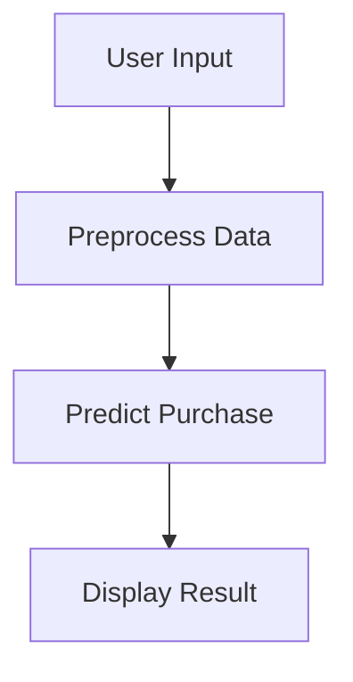

# 🚗 Car Insurance Purchase Prediction

## 📌 Overview
Machine learning model to predict customer insurance purchase likelihood using Flask.

## 🛠️ Tech Stack
| Category       | Tools Used |
|----------------|------------|
| **Frontend**   | HTML, CSS, Bootstrap |
| **Backend**    | Python, Flask |
| **ML**         | scikit-learn, Random Forest |
| **Deployment** | ngrok (for demos) |

## 🚀 How to Run
1. Clone the repo:
   ```bash
   git clone https://github.com/yourusername/car_insurance_prediction.git
   ```
2. Install dependencies:
   ```bash
   pip install -r requirements.txt
   ```
3. Run the app:
   ```bash
   python app.py
   ```
4. Access at: `http://localhost:5000`

## 📂 Project Structure
```
car_insurance_prediction/
├── app.py               # Flask application
├── train_model.py       # Model training
├── data/                # Insurance datasets
├── models/              # Saved ML models
└── templates/           # HTML templates
```

## 📊 Flowchart


## 🤝 Contributing
Pull requests welcome! For major changes, open an issue first.

## 📜 License
MIT